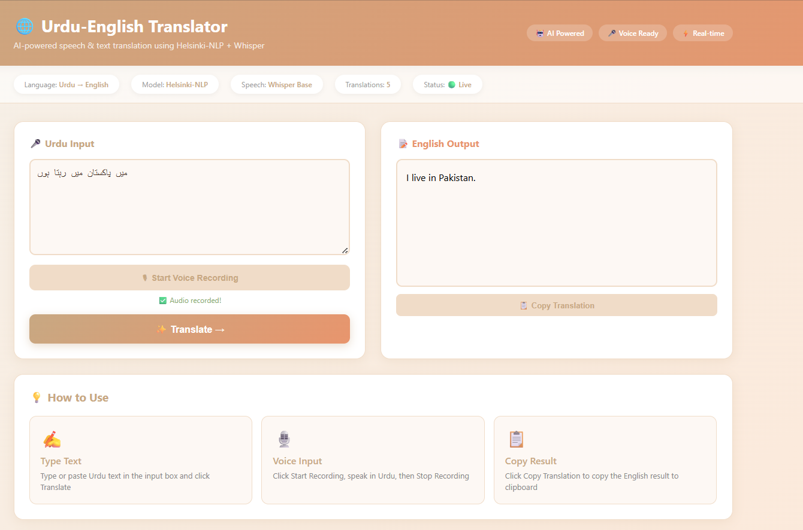
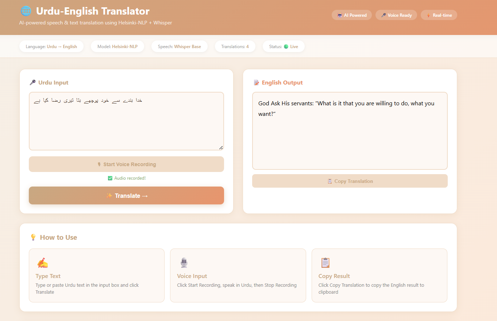

# 🌐 Urdu-English AI Translator

AI-powered Urdu to English translator with voice recording support.

## ✨ Features
- Type Urdu text and get instant English translation
- Voice recording — speak Urdu, get English translation
- Translation history
- Copy to clipboard
- Beautiful warm-toned dashboard

## 🛠️ Tech Stack
- **Frontend:** React.js
- **Backend:** Django REST Framework
- **Speech to Text:** OpenAI Whisper
- **Translation:** Helsinki-NLP (opus-mt-ur-en)

## 🚀 How to Run

### Backend
```bash
cd urdu_backend
pip install -r requirements.txt
python manage.py runserver
```

### Frontend
```bash
cd urdu-translator-frontend
npm install
npm start
```

Then open http://localhost:3000

## 📸 Screenshots



